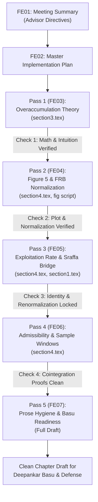

# FE02: Master Implementation Plan — Advisor Directives & Sequential Editing Workflow

**Target Manuscript:** `chapter1_edit/02_Versions/WP_CriticalReplication_3.0/`  
**Supervisory Context:** Michael Ash Meeting Debrief ([FE01_Meeting_Summary.md](file:///c:/ReposGitHub/Critical-Replication-Shaikh/chapter1_edit/12_FinalEdits/FE01_Meeting_Summary.md))  
**Lexical Protocol Reference:** [AI_TRACE_LEXICAL_DISCIPLINE_PROTOCOL.md](file:///c:/ReposGitHub/Critical-Replication-Shaikh/chapter1_edit/12_FinalEdits/AI_TRACE_LEXICAL_DISCIPLINE_PROTOCOL.md)  
**Steering Loop Reference:** [FE08_Controlled_Pass_Steering_Loop.md](file:///c:/ReposGitHub/Critical-Replication-Shaikh/chapter1_edit/12_FinalEdits/FE08_Controlled_Pass_Steering_Loop.md)  
**Review Target:** Committee delivery to Deepankar Basu in 5–10 days; Defense target late August.  
**Execution Strategy:** Sequential, modular passes. All edits are audited against the lexical discipline protocol before insertion.

---

## 1. Structure of the Five Sequential Passes

The revisions requested by Michael Ash are divided into five distinct stages. Each pass addresses a specific section of the manuscript, provides tested text replacements, and defines empirical checks before the next pass begins.

```
┌────────────────────────────────────────────────────────────────────────────────────────┐
│                              Five Sequential Editing Stages                            │
├─────────┬───────────────────────────────┬──────────────────────┬───────────────────────┤
│ Pass    │ Focus Area                    │ Target Files         │ Implementation Note   │
├─────────┼───────────────────────────────┼──────────────────────┼───────────────────────┤
│ Pass 1  │ Overaccumulation & Latent     │ section3.tex         │ FE03_Pass1_Overacc... │
│         │ Capacity Theory (θ < 1)       │ AppendixODE/         │                       │
├─────────┼───────────────────────────────┼──────────────────────┼───────────────────────┤
│ Pass 2  │ Figure 5 Audit & FRB Series   │ section4.tex         │ FE04_Pass2_Figure5... │
│         │ Normalization Alignment       │ codes/20_S0_...FAN.R │                       │
├─────────┼───────────────────────────────┼──────────────────────┼───────────────────────┤
│ Pass 3  │ Exploitation Rate (e_t) &     │ section4.tex         │ FE05_Pass3_Exploit... │
│         │ Sraffa-Kurz Choice of Techn.  │ section1.tex         │                       │
├─────────┼───────────────────────────────┼──────────────────────┼───────────────────────┤
│ Pass 4  │ Cointegration Admissibility & │ section4.tex         │ FE06_Pass4_Admissi... │
│         │ Sample Window Sensitivity     │ section4.tex (\S 4.7)│                       │
├─────────┼───────────────────────────────┼──────────────────────┼───────────────────────┤
│ Pass 5  │ Prose Hygiene, AI De-biasing, │ section1.tex, 2.tex, │ FE07_Pass5_Prose_H... │
│         │ & Deepankar Review Readiness  │ section5.tex         │                       │
└─────────┴───────────────────────────────┴──────────────────────┴───────────────────────┘
```

---

## 2. Sequence and Pre-Pass Verification Checks

Edits must proceed in numerical sequence. Theoretical adjustments in Pass 1 provide the basis for the empirical descriptions in Pass 2, which lead into the multi-equation specification in Pass 3 and the sample sensitivity discussion in Pass 4, ending with overall prose refinement in Pass 5.



### Universal Verification Rules (Enforced at Every Pass)
1. **Compilation Check:** `pdflatex` or `latexmk` must compile cleanly with 0 errors, no unresolved citation or cross-reference warnings.
2. **Lexical Audit Check:** Proposed text must pass the 11-family audit in [AI_TRACE_LEXICAL_DISCIPLINE_PROTOCOL.md](file:///c:/ReposGitHub/Critical-Replication-Shaikh/chapter1_edit/12_FinalEdits/AI_TRACE_LEXICAL_DISCIPLINE_PROTOCOL.md), avoiding rhetorical intensifiers, unneeded contrast constructions, and nominalization clusters.
3. **Empirical Consistency Rule:** The reconstructed parameter $\hat{\theta} \approx 0.727$ remains an empirical estimate. Statistical retention is distinguished from economic plausibility ($\hat{\theta} = 1.19$ is retained statistically under BIC but set aside economically due to trend contamination).
4. **Version Control Guardrails:** Edits are restricted to [chapter1_edit/02_Versions/WP_CriticalReplication_3.0/](file:///c:/ReposGitHub/Critical-Replication-Shaikh/chapter1_edit/02_Versions/WP_CriticalReplication_3.0/).

---

## 3. Scope of Individual Pass Notes

### [Pass 1: FE03_Pass1_Overaccumulation_Theory.md](file:///c:/ReposGitHub/Critical-Replication-Shaikh/chapter1_edit/12_FinalEdits/FE03_Pass1_Overaccumulation_Theory.md)
* **Advisor Directive:** Clarify overaccumulation ($\theta < 1$) and the dynamic equation for $d\hat{k}/dt$. Explain why capitalists accumulate 10% more capital when capacity expands by only 8%, and why price signals do not immediately halt accumulation.
* **Content:** Modifies paragraphs 3.17–3.20 in [section3.tex](file:///c:/ReposGitHub/Critical-Replication-Shaikh/chapter1_edit/02_Versions/WP_CriticalReplication_3.0/section3.tex). Introduces a numerical example (10% capital growth vs. 8% capacity growth). Explains workplace shift organization, latent unobserved capacity, and competitive pressures to defend market share. Explains why institutional mechanisms (wages, interest rates, capital write-downs) keep $d\hat{k}/dt$ within bounds. Defends the single-sector framework as an analytical simplification.

### [Pass 2: FE04_Pass2_Figure5_Data_Discrepancies.md](file:///c:/ReposGitHub/Critical-Replication-Shaikh/chapter1_edit/12_FinalEdits/FE04_Pass2_Figure5_Data_Discrepancies.md)
* **Advisor Directive:** Address the scaling and visual divergence in Figure 5 (`fig_S0_cu_fan_diagnostic`) between the Federal Reserve Board series and Shaikh’s $u_K$ index.
* **Content:** Standardizes normalization in [codes/20_S0_override_v8_FigureFAN.R](file:///c:/ReposGitHub/Critical-Replication-Shaikh/codes/20_S0_override_v8_FigureFAN.R) and revises paragraphs 4.14–4.16 in [section4.tex](file:///c:/ReposGitHub/Critical-Replication-Shaikh/chapter1_edit/02_Versions/WP_CriticalReplication_3.0/section4.tex). Explains the methodological difference: the FRB index measures operating rates relative to existing plant capacity and reverts to an 80% mean, whereas Shaikh’s index reflects the long-run output–capital relation across investment cycles, showing the post-1973 decline in capital productivity.

### [Pass 3: FE05_Pass3_Exploitation_Sraffa_Bridge.md](file:///c:/ReposGitHub/Critical-Replication-Shaikh/chapter1_edit/12_FinalEdits/FE05_Pass3_Exploitation_Sraffa_Bridge.md)
* **Advisor Directive:** Provide an economic rationale for including the exploitation rate ($e_t$) in the VECM, avoiding purely mechanical statistical explanations.
* **Content:** Grounds $e_t$ in Heinz Kurz (1986) choice-of-technique framework. Formulates the log-odds relation $\ln(e_t) = \ln(\pi_t) - \ln(\omega_t)$, linking the exploitation rate to both profit share and wage share. Explains the reserve-army dynamic: $\ln e_t = -0.05 (\ln Y_t - 0.727 \ln K_t)$. Clarifies why additional permutations of raw wage share or profit rate are econometrically problematic.

### [Pass 4: FE06_Pass4_Admissibility_Sample_Fragility.md](file:///c:/ReposGitHub/Critical-Replication-Shaikh/chapter1_edit/12_FinalEdits/FE06_Pass4_Admissibility_Sample_Fragility.md)
* **Advisor Directive:** Explain admissibility in terms of basic cointegration principles and report the sample sensitivity between 1947–2007 and 1947–2011.
* **Content:** Defines admissibility directly: nonstationary residuals imply spurious cointegration and an unstable capacity ceiling. Documents that the bivariate system $(\ln Y, \ln K)$ yields 12 cointegrating specifications in 1947–2007 ($T=61$) but 0 in 1947–2011 ($T=65$) due to the post-2007 contraction. Explains why historical step dummies (1956, 1974, 1980) are required for cointegration.

### [Pass 5: FE07_Pass5_Prose_Hygiene_Basu_Readiness.md](file:///c:/ReposGitHub/Critical-Replication-Shaikh/chapter1_edit/12_FinalEdits/FE07_Pass5_Prose_Hygiene_Basu_Readiness.md)
* **Advisor Directive:** Ensure prose is unpretentious, clear, and ready for Deepankar Basu’s review.
* **Content:** Removes AI stylistic traces and unnecessary intensifiers across [section1.tex](file:///c:/ReposGitHub/Critical-Replication-Shaikh/chapter1_edit/02_Versions/WP_CriticalReplication_3.0/section1.tex), [section2.tex](file:///c:/ReposGitHub/Critical-Replication-Shaikh/chapter1_edit/02_Versions/WP_CriticalReplication_3.0/section2.tex), and [section5.tex](file:///c:/ReposGitHub/Critical-Replication-Shaikh/chapter1_edit/02_Versions/WP_CriticalReplication_3.0/section5.tex). Formulates a direct Introduction, brings the literature review down to earth without changing structure, and provides a 10-point submission checklist.

---

## 4. Execution Workflow

When running each pass:
1. Open the specific pass note (`FE03` through `FE07`).
2. Verify the pre-pass audit entries in [FE08_Controlled_Pass_Steering_Loop.md](file:///c:/ReposGitHub/Critical-Replication-Shaikh/chapter1_edit/12_FinalEdits/FE08_Controlled_Pass_Steering_Loop.md).
3. Apply the disciplined text replacement to `WP_CriticalReplication_3.0`.
4. Compile `main.tex` and inspect PDF output.
5. Check off the stopping rules before proceeding to the next stage.

### Tracking Ledger
- [x] **Pass 1: Overaccumulation Theory (`FE03`)** — *Completed & Compiled (58 pages)*
- [x] **Pass 2: Figure 5 & Data Alignment (`FE04`)** — *Completed & Compiled (58 pages)*
- [x] **Pass 3: Exploitation Rate & Sraffa Bridge (`FE05`)** — *Completed & Compiled (58 pages)*
- [x] **Pass 4: Admissibility & Sample Windows (`FE06`)** — *Completed & Compiled (58 pages)*
- [x] **Pass 5: Prose Hygiene & Basu Readiness (`FE07`)** — *Completed & Compiled (58 pages)*
